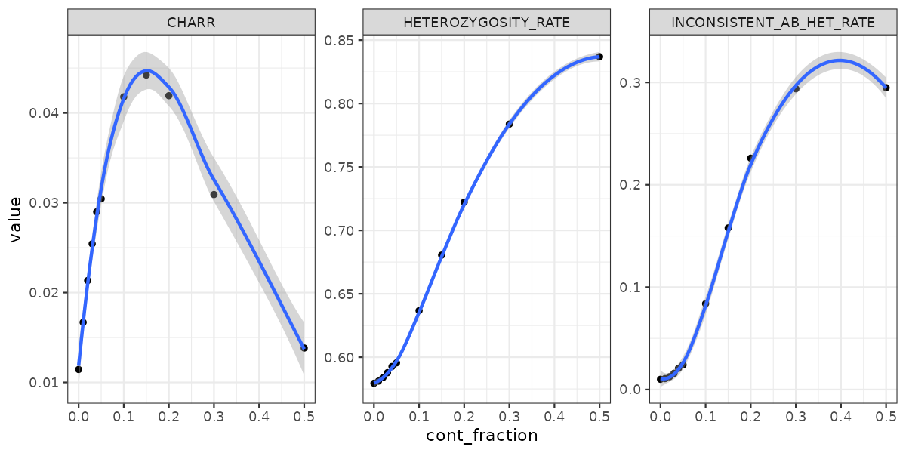
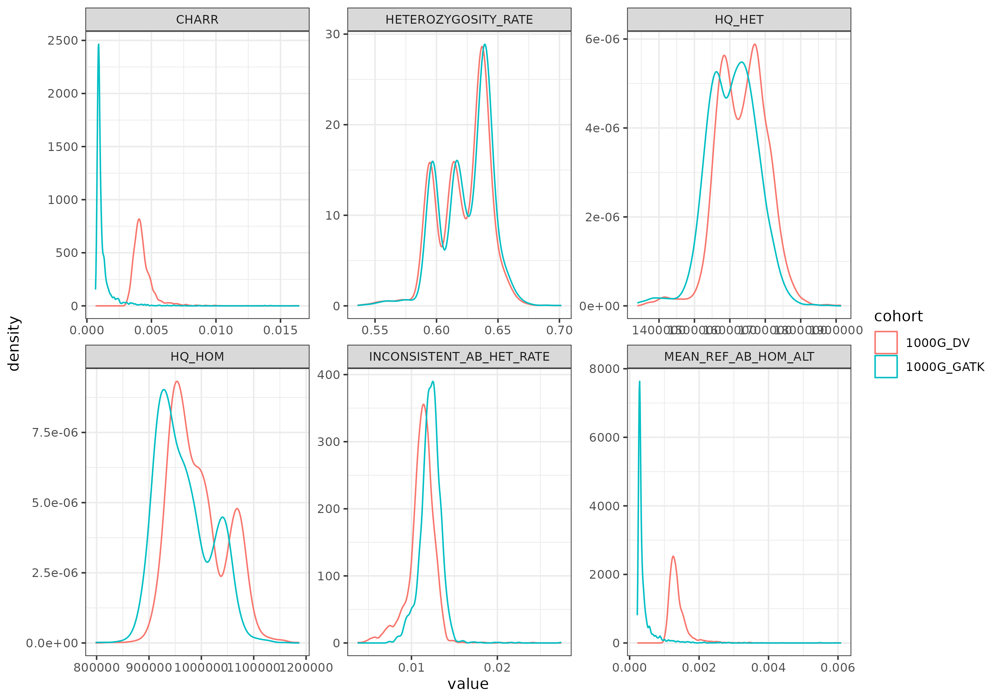

# Example datasets and simulations

## Simulation results

To simulate contamination we generated mixed samples using 2 samples from the GIAB reference datasets. Briefly, we generated a 30X BAM file of NA24631 GIAB sample and then mixed this with various proportion of reads from NA24385. See results below and plots in the example folder.

|SAMPLE         |HQ_HOM |HQ_HOM_RATE|HQ_HET |HQ_HET_RATE|CHARR  |MEAN_REF_AB_HOM_ALT|HETEROZYGOSITY_RATE|INCONSISTENT_AB_HET_RATE|
|---------------|-------|-----------|-------|-----------|-------|-------------------|-------------------|------------------------|
|original_sample|1101063|1.00000    |1516921|0.96191    |0.01144|0.00371            |0.57942            |0.00999                 |
|cont_0.99_0.01 |1092683|1.00000    |1515890|0.96113    |0.01669|0.00598            |0.58112            |0.01068                 |
|cont_0.98_0.02 |1079498|1.00000    |1514989|0.95938    |0.02134|0.00794            |0.58393            |0.01249                 |
|cont_0.97_0.03 |1062034|1.00000    |1514340|0.95648    |0.02543|0.00963            |0.58778            |0.01580                 |
|cont_0.96_0.04 |1040781|1.00000    |1514274|0.95240    |0.02899|0.01107            |0.59266            |0.02079                 |
|cont_0.95_0.05 |1027437|1.00000    |1512849|0.94977    |0.03044|0.01164            |0.59554            |0.02412                 |
|cont_0.85_0.15 |741203 |1.00000    |1578589|0.86162    |0.04422|0.01578            |0.68049            |0.15782                 |
|cont_0.9_0.1   |874280 |1.00000    |1532181|0.90654    |0.04179|0.01559            |0.63669            |0.08385                 |
|cont_0.8_0.2   |635342 |1.00000    |1652251|0.82522    |0.04192|0.01431            |0.72227            |0.22597                 |
|cont_0.7_0.3   |505642 |1.00000    |1832859|0.78729    |0.03092|0.00972            |0.78378            |0.29380                 |
|cont_0.5_0.5   |409987 |1.00000    |2103835|0.78209    |0.01383|0.00371            |0.83691            |0.29484                 |

The simulation results are in simulation_results.tsv, and the plot_simulation_results.R script can be used to generate the plot below.

### Metrics plot

## Reference datasets

We used 1000G cohort variant calling generated using GATK or DeepVariant from [Yun T. et al., 2021](https://academic.oup.com/bioinformatics/article/36/24/5582/6064144) to generate two reference datasets using our tool. The reference datasets are available in the example folder as 1000G_DeepVar.sce.tsv and 1000G_GATK.sce.tsv.

Comparing these 2 datasets, we observed that data generated with the 2 variant callers have specific distributions of the CHARR values.

